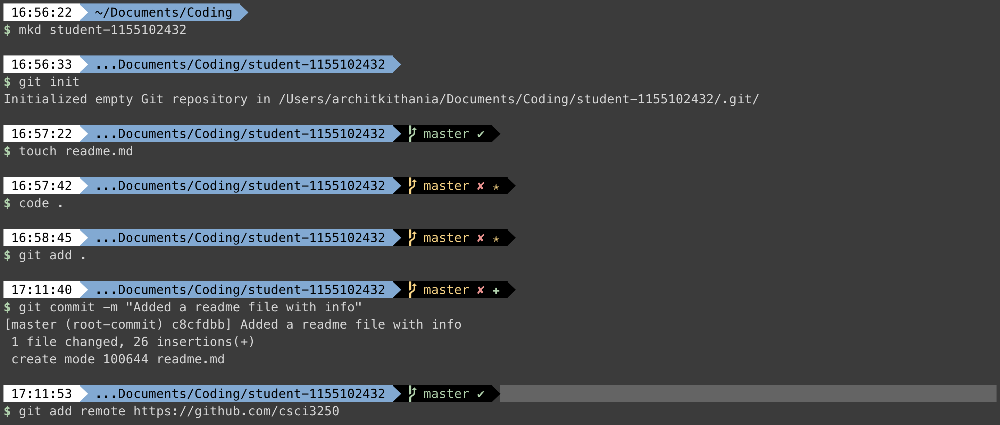
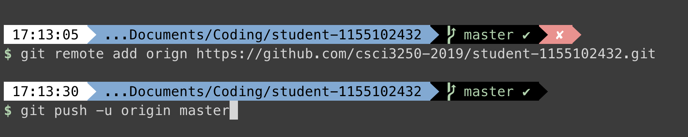

## Archit Kithania

I have been **programming** for 3 years and I love learning new technologies. I have a strong interest in machine learning and want to spend some more time improving my skills. 

### Programming Languages

- Python
- C
- Javascript
- Java

### Exams to study for

- [x] Data Structures
- [x] English
- [ ] probability

### Personal Info

| Field      | Value |
| ----------  | ----------   |
| Name    | Archit Kithania     |
| Age     | 18     |
| Major  | Computer Science | 

### Commands

